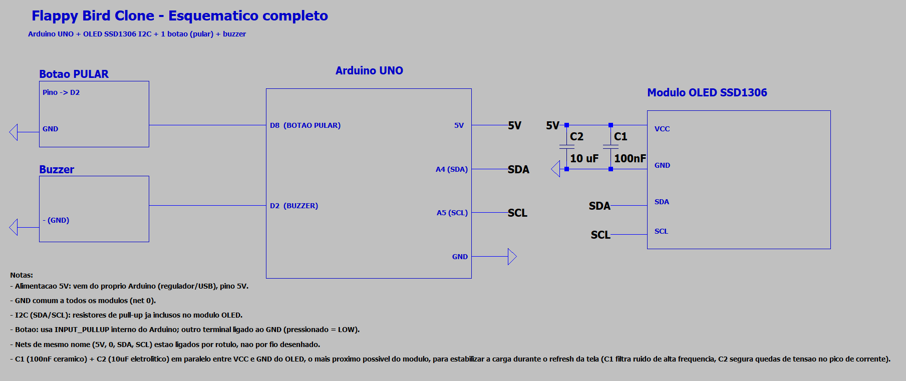
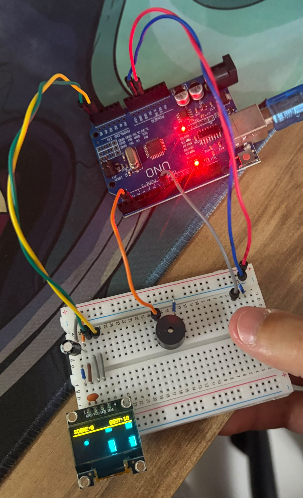

# 🐤 Flappy Bird Clone

Clone do clássico Flappy Bird na OLED 128x64, com um único botão controlando o impulso vertical do pássaro e canos gerados proceduralmente.

## Como funciona

0. **Tela inicial** — mostra o título "FLAPPY" e o recorde salvo (persistido na EEPROM). Aperte o botão para começar.
1. **Física** — o pássaro cai continuamente por gravidade simulada em software (`passaroVelY += GRAVIDADE` a cada tick). Cada aperto do botão aplica um impulso negativo instantâneo na velocidade (pulo), sem bloquear o loop.
2. **Canos** — três canos com um vão (gap) fixo de altura se movem continuamente da direita para a esquerda. Ao sair da tela, cada cano reaparece à direita do último, com uma nova posição de gap sorteada aleatoriamente.
3. **Pontuação** — ao ultrapassar um cano (sem colidir), a pontuação aumenta e o buzzer toca um bipe agudo.
4. **Colisão** — bater em um cano ou tocar o teto/chão do campo termina a partida. O buzzer toca um bipe grave de game over, e a tela mostra a pontuação final (com aviso de novo recorde, se for o caso).
5. **Recorde** — o melhor resultado é salvo na EEPROM do Arduino, sobrevivendo a desligamentos.

## 🔌 Hardware e Circuito

Abaixo estão o diagrama esquemático das conexões e a montagem física do protótipo:

Diagrama Esquemático

*Esquema elétrico / pinagem*

Montagem Física

*Protótipo montado na protoboard*
## Pinout

| Componente   | Pino Arduino |
|--------------|--------------|
| Botão PULAR  | D2           |
| Buzzer       | D8           |
| OLED SDA     | A4 (I2C)     |
| OLED SCL     | A5 (I2C)     |

O botão usa o pull-up interno do Arduino (`INPUT_PULLUP`): um terminal no pino digital, o outro no GND. Pressionado = LOW.

## Componentes adicionais

| Componente | Ligação |
|------------|---------|
| C1 — capacitor cerâmico 100nF | Em paralelo entre VCC e GND do módulo OLED |
| C2 — capacitor eletrolítico 10µF | Em paralelo entre VCC e GND do módulo OLED |

Os dois capacitores ficam o mais próximo possível dos pinos VCC/GND do OLED, em paralelo um com o outro: o cerâmico (C1) filtra ruído de alta frequência do próprio chaveamento do display, e o eletrolítico (C2) segura a queda de tensão nos picos de corrente do refresh da tela — evitando piscadas/resets da OLED sob carga.

## Bibliotecas

- Adafruit SSD1306
- Adafruit GFX
- EEPROM (nativa do Arduino)

## Layout / cores

Assume uma OLED SSD1306 "duas cores" (faixa amarela fixa em y=0–15, azul no resto — físico, não controlado por software). O placar (`SCORE:x` / `BEST:x`) fica na faixa amarela; o campo de jogo (pássaro, canos) ocupa a faixa azul, de y=16 a y=63.

## Destaques técnicos

- **Física por integração simples**: velocidade vertical (`passaroVelY`) acumula gravidade a cada tick (`passaroVelY += GRAVIDADE`, com clamp de velocidade máxima de queda) e é somada à posição (`passaroY += passaroVelY`); o pulo apenas reatribui a velocidade instantaneamente, sem `delay()`.
- **Geração procedural de canos com buffer circular lógico**: apenas `MAX_CANOS` (3) canos existem na memória. Ao sair da tela pela esquerda, um cano é reposicionado à direita do cano mais distante (`maiorX + ESPACAMENTO_CANOS`) com um novo gap sorteado — sem alocar ou copiar arrays.
- Colisão feita por sobreposição de eixos (bounding box do pássaro contra a coluna do cano), checando separadamente se o pássaro está dentro do vão (`dentroDoGap`) quando há sobreposição horizontal.
- Pontuação detectada por borda: cada cano tem uma flag `pontuado` para não contar duas vezes a mesma passagem.
- Recorde persistido na EEPROM (`EEPROM.get`/`EEPROM.put`) — sobrevive a desligar o Arduino, ao contrário de uma variável só em RAM.
- Entrada do botão com debounce por software (detecção de borda de descida com buffer de "borda pendente") — o pulo é aplicado no próximo frame de física, nunca perdendo um aperto.
- Máquina de estados (Tela Inicial ↔ Jogando ↔ Game Over) 100% não-bloqueante com `millis()` dentro do `loop()`, sem `delay()`.
- **Desacoplamento de alimentação da OLED**: C1 (100nF cerâmico) + C2 (10µF eletrolítico) em paralelo entre VCC e GND do módulo, bem próximos dele — estabilizam a tensão durante os picos de corrente do refresh da tela.

## Estrutura

```
FlappyBirdClone/
├── README.md
├── post_linkedin.txt
├── sketch_flappybird/
│   └── sketch_flappybird.ino
├── Esquemático/
│   └── Draft1.asc
└── circuit_images/
    └── .gitkeep
```

